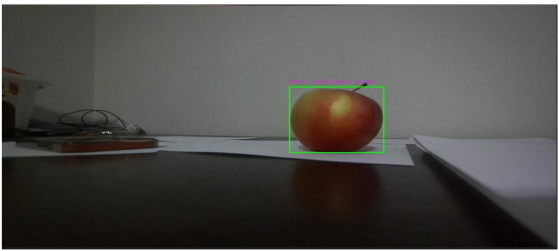
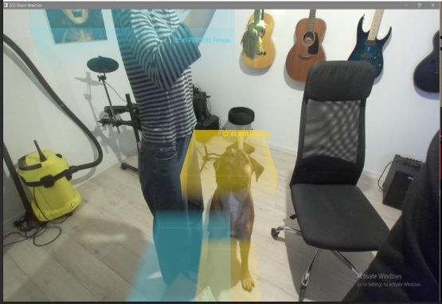
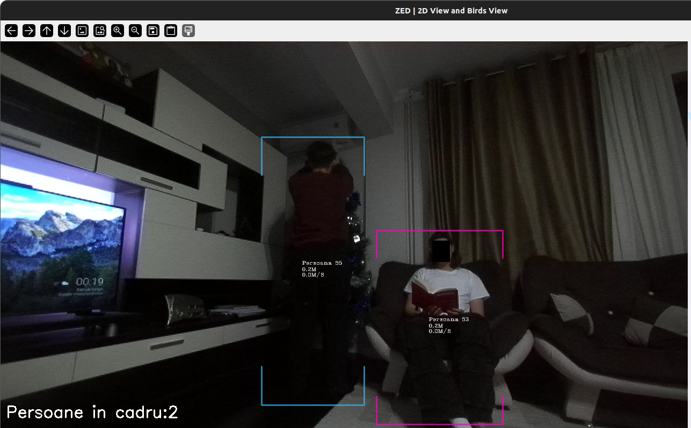

# ZED2i YOLO 3D Object Detection
Collection of Python scripts for 3D object detection using Stereolabs ZED2i camera and YOLOv8. Written as a group project for my Image Processing university course.

## About
This repository contains Python scripts developed throughout the Image Processing course, exploring real-time 3D object detection capabilities. The project progressed in two phases: the midterm phase involved experimenting with OpenCV for 2D detection and OpenGL for 3D visualization using the ZED SDK. The final phase focused on modifying an existing ZED SDK script to integrate YOLOv8 network support. A custom YOLO model was trained specifically to improve consistent 3D person detection, with additional data logging and visualization features added to the detection pipeline.

## Small gallery
| OpenCV | OpenGL | YOLOv8 |
|:----------:|:----------:|:---------:|
|  |  |  |

## Technologies Used

**Programming & Environment**
- **Python 3.8** - Primary programming language 
- **Anaconda** - Environment and package management

**Computer Vision Libraries**
- **OpenCV** - 2D image processing and detection visualization
- **OpenGL** - 3D rendering and visualization

**Hardware & SDK**
- **Stereolabs ZED2i Camera** - Stereo camera for depth sensing and 3D perception
- **ZED SDK** - Official SDK for camera control, depth mapping, and spatial tracking

**Machine Learning**
- **YOLOv8** - Deep learning network for real-time object detection
  - *Note: The trained YOLO model file (best2.pt) is not included in this repository due to its large size. It can be provided upon request via email or cloud storage link.*

**Additional Tools**
- **NumPy** - Numerical computations and array operations
- **CUDA** - GPU acceleration for neural network inference 

